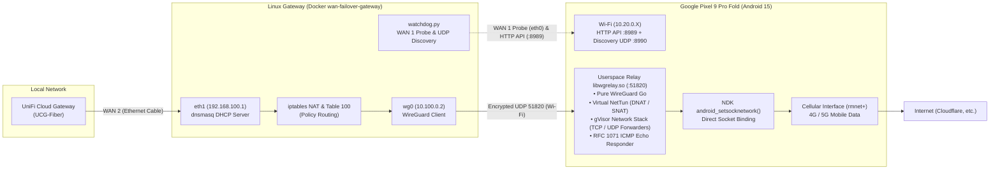

# Cellular WAN Failover

Automated, invisible network backup gateway (**Failover WAN 2**) for **UniFi Cloud Gateway (UCG-Fiber)** using an unrooted Android smartphone connected via Wi-Fi to route local network traffic out through its mobile connection (LTE/5G) without root, without Wi-Fi hotspot tethering, without disconnecting the phone from local Wi-Fi, and **without using Android's `VpnService` API** (zero VPN permission dialogs and zero 🔑 key icon in the Android status bar).

---

## 1. Architecture Overview



### Key Technical Highlights
* **Zero VpnService** : WireGuard relay compiled as a native C/Go shared library (`libwgrelay.so`) running completely in userspace. Zero VPN permission prompts and zero key icon in the Android status bar.
* **Zero SOCKS5 / tun2socks** : Pure WireGuard architecture end-to-end delivering optimal throughput and supporting IP, UDP (DNS), and ICMP (UniFi health check pings).
* **Forced Cellular Outbound** : Outbound internet sockets are bound directly to the active cellular network handle using NDK `android_setsocknetwork(netHandle, fd)`. The smartphone remains connected to local Wi-Fi.
* **Android 15 (ARM64) 16 KB Page-Size Compliant** : Native binary built with 16 KB ELF page alignment (`-Wl,-z,max-page-size=16384`) verified via `zipalign`.
* **Power Efficiency** : During normal operation, cellular data and the WireGuard relay remain dormant (`idle`). They are awakened on-demand by the gateway only when WAN 1 fails.
* **Complete Host Isolation** : Everything runs inside an all-in-one Alpine Docker container using `--network host`. No packages installed on the host OS.

---

## 2. Repository Structure

```text
mobile-wan-backup/
├── .devcontainer/             # Containerized dev environment (Java 21, Android SDK 35/36, NDK r28, Go 1.24)
├── android/                   # Native Android application (Kotlin Compose + Go C-Shared relay)
│   ├── app/                   # Kotlin app (Ktor HTTP :8989, Discovery :8990, Compose UI)
│   ├── wgrelay/               # Userspace WireGuard relay in Go (gVisor, DNAT/SNAT, NDK bind)
│   └── build_wgrelay.sh       # NDK arm64 build script (16 KB page alignment)
└── gateway/                   # All-in-one failover gateway under Docker
    ├── Dockerfile             # Alpine image (dnsmasq, wireguard-tools, iptables, python3)
    ├── docker-compose.yml     # Docker host service with cap_add NET_ADMIN
    ├── .env.example           # Centralized environment configuration template
    ├── entrypoint.sh          # Container entrypoint (auto-ip, internal dnsmasq, watchdog)
    ├── watchdog.py            # WAN 1 monitoring and automatic failover daemon
    └── wan_ctl.sh             # CLI control and testing utility script
```

---

## 3. Network Topology & Addressing

| Segment | Interface | Role | IP Addressing |
| :--- | :--- | :--- | :--- |
| **Local LAN** | `eth0` (Pi) & Wi-Fi | Local network & WAN 1 | `10.20.0.0/24` (Default gateway) |
| **UniFi WAN 2 Link** | `eth1` (Pi <-> UCG) | Direct Ethernet cable | Pi: `192.168.100.1` / UniFi: `192.168.100.10` (DHCP) |
| **WireGuard Tunnel** | `wg0` | Encrypted tunnel over Wi-Fi | Phone: `10.100.0.1` / Pi: `10.100.0.2` (UDP `51820`) |
| **Cellular WAN** | `rmnet+` (Android) | Cellular backup outbound | Public IP assigned by mobile carrier |

---

## 4. Deployment Guide

### Step 1: Android Application (`android/`)

1. **Enable Wireless Debugging** on the smartphone (*Settings > Developer Options > Wireless Debugging*).
2. **Connect ADB** :
   ```bash
   adb connect <PHONE_IP>:<ADB_PORT>
   ```
3. **Build Native Relay & APK** :
   ```bash
   bash android/build_wgrelay.sh
   cd android && ./gradlew assembleDebug
   adb install -r app/build/outputs/apk/debug/app-debug.apk
   ```
4. **Launch Application** :
   * Open the app on the phone. The *Foreground Service* starts with an ongoing persistent notification.
   * In Android settings for the app, set Battery usage to **Unrestricted**.

### Step 2: Gateway Deployment (`gateway/`)

#### Option A: Deploy with repository directory
1. **Copy `gateway/` directory** to the gateway host (e.g. `~/wan-failover`).
2. **Configure Environment** (optional if using defaults):
   ```bash
   cd ~/wan-failover
   cp .env.example .env
   ```
3. **Start Docker container** (or build locally with `--build`):
   ```bash
   docker compose up -d
   ```
4. **Verify status** :
   ```bash
   ./wan_ctl.sh status
   ```

#### Option B: Deploy with standalone `compose.yaml` (No Git clone needed)
Create `compose.yaml` on the host:
```yaml
services:
  wan-failover-gateway:
    image: ghcr.io/tichael/cellular-wan-gateway:latest
    container_name: wan-failover-gateway
    restart: unless-stopped
    network_mode: host
    cap_add:
      - NET_ADMIN
      - NET_RAW
    environment:
      - PRIMARY_IFACE=eth0
      - FAILOVER_IFACE=eth1
      - FAILOVER_GATEWAY_IP=192.168.100.1
      - FAILOVER_CIDR=24
      - FAILOVER_NETMASK=255.255.255.0
      - AUTO_CONFIGURE_IFACE=true
      - DHCP_ENABLED=true
      - DHCP_RANGE_START=192.168.100.10
      - DHCP_RANGE_END=192.168.100.20
      - DHCP_LEASE_TIME=12h
      - DNS_SERVERS=9.9.9.10,149.112.112.10
      - ROUTING_TABLE_ID=100
      - WG_IFACE=wg0
      - CLAMP_MSS=true
      - PING_TARGETS=1.1.1.1 8.8.8.8
      - PING_TIMEOUT=2
      - CANARY_IP=198.18.0.1
      - FAIL_THRESHOLD=3
      - RESTORE_THRESHOLD=5
      - CHECK_INTERVAL=5
    volumes:
      - /lib/modules:/lib/modules:ro
```
Run: `docker compose up -d`

---

## 5. Operations & CLI Utility (`wan_ctl.sh`)

On the gateway host, use [`wan_ctl.sh`](gateway/wan_ctl.sh):

```bash
# Check smartphone status, relay state, and transmitted bytes
./wan_ctl.sh status

# Discover smartphone IP on local Wi-Fi via UDP beacons (port 8990)
./wan_ctl.sh discover

# Manually trigger cellular failover activation
./wan_ctl.sh start

# Manually stop failover (return smartphone to low-power standby)
./wan_ctl.sh stop

# Test WAN 1 primary probe connectivity (eth0)
./wan_ctl.sh test-probe

# Verify if egress path is direct (WAN 1) or hairpinned (WAN 2)
./wan_ctl.sh test-route

# Tail watchdog container logs in real time
docker logs -f wan-failover-gateway
```

---

## 6. Automated Production Behavior

1. **Continuous Monitoring** : The watchdog continuously monitors WAN 1 (`eth0`) using periodic ICMP pings to `1.1.1.1` and `8.8.8.8`.
2. **Outage Detection** : Upon 3 consecutive ping failures, the watchdog invokes the phone's local HTTP API (`POST /v1/failover/start`).
3. **Instant Failover** : The phone activates cellular data and starts its userspace WireGuard relay. The Pi brings up `wg0`, sets up Table 100 policy routing, and configures iptables MASQUERADE. The router detects WAN 2 healthy and routes all LAN traffic through it.
4. **Tunnel Canary Verification & Automatic Recovery (Failback)** : While failover is active, the watchdog probes a non-routable benchmark IP (`198.18.0.1`, RFC 2544 / RFC 6890). If LAN default traffic is routed out WAN 2, the phone's WireGuard relay synthesizes replies and the canary succeeds, keeping failover active without flapping. Once primary WAN 1 recovers and the router switches its default route back to WAN 1, the canary times out (ISPs drop `198.18.0.1`). The watchdog then verifies direct internet connectivity via primary WAN 1 (`1.1.1.1`). After 5 consecutive direct successes, the Pi tears down `wg0`, flushes routing tables, and signals the phone to release cellular data (`POST /v1/failover/stop`).

